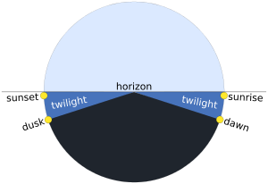
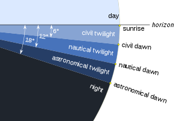
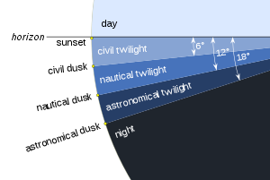

# 장고 라이트닝 토크 - Django-celery-beat 실습

(16:30 ~ 16:50) 백경준 - 아직도 보고서를 직접 보내시나요?(Feat.Django-celery-beat)  

***

실습을 해보기 전에 공식 문서의 내용을 꼭 읽어보세요!  
> ## 공식 문서  
### celery
- http://docs.celeryproject.org/en/latest/  

### django-celery-beat
- https://django-celery-beat.readthedocs.io/en/latest/  

> ## 실습 환경
- python 3.8.2
- Redis server 5.0.5  

> ## requirements.txt
amqp==2.6.0  
asgiref==3.2.7  
billiard==3.6.3.0  
celery==4.4.5  
Django==3.0.7  
django-celery-beat==2.0.0  
django-timezone-field==4.0  
future==0.18.2  
kombu==4.6.10  
python-crontab==2.5.1  
pytz==2020.1  
redis==3.5.3  
sqlparse==0.3.1  
vine==1.3.0    

> ## 가상환경 생성
    $ python -m venv venv  

> ## 가상환경 활성화
 ### Linux & MAC
    $ source venv/bin/activate  
 ### Windows
    $ source venv\Scripts\activate.bat  

> ## packages 설치
    (venv) $ pip install -r requirements.txt  

> ## 데이터 베이스migration 
    (venv) $ python manage.py migrate  

> ## Django(WAS) 실행  
    (venv) $ python manage.py runserver  

> ## Celery 실행
    (venv) $ celery worker -A config -P --loglevel=INFO  

> ## Celery beat 실행 
    (venv) $ celery beat -A config  --loglevel=INFO  

---
> # celery beat schedule 설명 
 ## django_celery_beat_clockedschedule

    일회성 작업은 clocked schedule을 쓰면 더 편할 것 같아요!.
    Periodic_task에 등록할 때
    one_off=True 옵션을 꼭 줘야합니다!
    주지 않으면 assign 에러가 납니다.

    clocked_time = models.DateTimeField(
        verbose_name=_('Clock Time'),
        help_text=_('Run the task at clocked time'),
    )
    enabled = models.BooleanField(
        default=True,
        editable=False,
        verbose_name=_('Enabled'),
        help_text=_('Set to False to disable the schedule'),
    )

## django_celery_beat_crontabschedule
 ## django_celery_beat_periodictask

    Priodic_task의 모델이자 옵션입니다. 
        
    name = models.CharField(
        max_length=200, unique=True,
        verbose_name=_('Name'),
        help_text=_('Short Description For This Task'),
    )
    task = models.CharField(
        max_length=200,
        verbose_name='Task Name',
        help_text=_('The Name of the Celery Task that Should be Run. '
                  '(Example: "proj.tasks.import_contacts")'),
    )
    # You can only set ONE of the following schedule FK's
    # TODO: Redo this as a GenericForeignKey
    interval = models.ForeignKey(
        IntervalSchedule, on_delete=models.CASCADE,
        null=True, blank=True, verbose_name=_('Interval Schedule'),
        help_text=_('Interval Schedule to run the task on.  '
                    'Set only one schedule type, leave the others null.'),
    )
    crontab = models.ForeignKey(
        CrontabSchedule, on_delete=models.CASCADE, null=True, blank=True,
        verbose_name=_('Crontab Schedule'),
        help_text=_('Crontab Schedule to run the task on.  '
                    'Set only one schedule type, leave the others null.'),
    )
    solar = models.ForeignKey(
        SolarSchedule, on_delete=models.CASCADE, null=True, blank=True,
        verbose_name=_('Solar Schedule'),
        help_text=_('Solar Schedule to run the task on.  '
                    'Set only one schedule type, leave the others null.'),
    )
    clocked = models.ForeignKey(
        ClockedSchedule, on_delete=models.CASCADE, null=True, blank=True,
        verbose_name=_('Clocked Schedule'),
        help_text=_('Clocked Schedule to run the task on.  '
                    'Set only one schedule type, leave the others null.'),
    )
    # TODO: use django's JsonField
    args = models.TextField(
        blank=True, default='[]',
        verbose_name=_('Positional Arguments'),
        help_text=_(
            'JSON encoded positional arguments '
            '(Example: ["arg1", "arg2"])'),
    )
    kwargs = models.TextField(
        blank=True, default='{}',
        verbose_name=_('Keyword Arguments'),
        help_text=_(
            'JSON encoded keyword arguments '
            '(Example: {"argument": "value"})'),
    )
    
    queue = models.CharField(
        max_length=200, blank=True, null=True, default=None,
        verbose_name=_('Queue Override'),
        help_text=_(
            'Queue defined in CELERY_TASK_QUEUES. '
            'Leave None for default queuing.'),
    )
    
    # you can use low-level AMQP routing options here,
    # but you almost certaily want to leave these as None
    # http://docs.celeryproject.org/en/latest/userguide/routing.html#exchanges-queues-and-routing-keys
    exchange = models.CharField(
        max_length=200, blank=True, null=True, default=None,
        verbose_name=_('Exchange'),
        help_text=_('Override Exchange for low-level AMQP routing'),
    )
    routing_key = models.CharField(
        max_length=200, blank=True, null=True, default=None,
        verbose_name=_('Routing Key'),
        help_text=_('Override Routing Key for low-level AMQP routing'),
    )
    headers = models.TextField(
        blank=True, default='{}',
        verbose_name=_('AMQP Message Headers'),
        help_text=_('JSON encoded message headers for the AMQP message.'),
    )
    
    priority = models.PositiveIntegerField(
        default=None, validators=[MaxValueValidator(255)],
        blank=True, null=True,
        verbose_name=_('Priority'),
        help_text=_(
            'Priority Number between 0 and 255. '
            'Supported by: RabbitMQ, Redis (priority reversed, 0 is highest).')
    )
    expires = models.DateTimeField(
        blank=True, null=True,
        verbose_name=_('Expires Datetime'),
        help_text=_(
            'Datetime after which the schedule will no longer '
            'trigger the task to run'),
    )
    expire_seconds = models.PositiveIntegerField(
        blank=True, null=True,
        verbose_name=_('Expires timedelta with seconds'),
        help_text=_(
            'Timedelta with seconds which the schedule will no longer '
            'trigger the task to run'),
    
    )
    one_off = models.BooleanField(
        default=False,
        verbose_name=_('One-off Task'),
        help_text=_(
            'If True, the schedule will only run the task a single time'),
    )
    start_time = models.DateTimeField(
        blank=True, null=True,
        verbose_name=_('Start Datetime'),
        help_text=_(
            'Datetime when the schedule should begin '
            'triggering the task to run'),
    )
    enabled = models.BooleanField(
        default=True,
        verbose_name=_('Enabled'),
        help_text=_('Set to False to disable the schedule'),
    )
    last_run_at = models.DateTimeField(
        auto_now=False, auto_now_add=False,
        editable=False, blank=True, null=True,
        verbose_name=_('Last Run Datetime'),
        help_text=_(
            'Datetime that the schedule last triggered the task to run. '
            'Reset to None if enabled is set to False.'),
    )
    total_run_count = models.PositiveIntegerField(
        default=0, editable=False,
        verbose_name=_('Total Run Count'),
        help_text=_(
            'Running count of how many times the schedule '
            'has triggered the task'),
    )
    date_changed = models.DateTimeField(
        auto_now=True,
        verbose_name=_('Last Modified'),
        help_text=_('Datetime that this PeriodicTask was last modified'),
    )
    description = models.TextField(
        blank=True,
        verbose_name=_('Description'),
        help_text=_(
            'Detailed description about the details of this Periodic Task'),
    )

 ## django_celery_beat_periodictasks

    Periodic_task의 추가, 수정, 삭제 변경사항을 기록하는 모델입니다.
    
    ident = models.SmallIntegerField(default=1, primary_key=True, unique=True)
    last_update = models.DateTimeField(null=False)

    crontabSchedule의 옵션이자 데이터베이스 모델입니다. 고정 시간으로 스케줄링합니다.
    ex) 
    
    minute = models.CharField(
        max_length=60 * 4, default='*',
        verbose_name=_('Minute(s)'),
        help_text=_(
            'Cron Minutes to Run. Use "*" for "all". (Example: "0,30")'),
        validators=[validators.minute_validator],
    )
    hour = models.CharField(
        max_length=24 * 4, default='*',
        verbose_name=_('Hour(s)'),
        help_text=_(
            'Cron Hours to Run. Use "*" for "all". (Example: "8,20")'),
        validators=[validators.hour_validator],
    )
    day_of_week = models.CharField(
        max_length=64, default='*',
        verbose_name=_('Day(s) Of The Week'),
        help_text=_(
            'Cron Days Of The Week to Run. Use "*" for "all". '
            '(Example: "0,5")'),
        validators=[validators.day_of_week_validator],
    )
    day_of_month = models.CharField(
        max_length=31 * 4, default='*',
        verbose_name=_('Day(s) Of The Month'),
        help_text=_(
            'Cron Days Of The Month to Run. Use "*" for "all". '
            '(Example: "1,15")'),
        validators=[validators.day_of_month_validator],
    )
    month_of_year = models.CharField(
        max_length=64, default='*',
        verbose_name=_('Month(s) Of The Year'),
        help_text=_(
            'Cron Months Of The Year to Run. Use "*" for "all". '
            '(Example: "0,6")'),
        validators=[validators.month_of_year_validator],
    )
    
    timezone = timezone_field.TimeZoneField(
        default='UTC',
        verbose_name=_('Cron Timezone'),
        help_text=_(
            'Timezone to Run the Cron Schedule on.  Default is UTC.'),
    )

 ## django_celery_beat_intervalschedule
    intervalschedule의 옵션이자 데이터베이스 모델입니다.상대 시간으로 스케줄링합니다. 
    
    every = models.IntegerField(
        null=False,
        verbose_name=_('Number of Periods'),
        help_text=_('Number of interval periods to wait before '
                    'running the task again'),
        validators=[MinValueValidator(1)],
    )
    period = models.CharField(
        max_length=24, choices=PERIOD_CHOICES,
        verbose_name=_('Interval Period'),
        help_text=_('The type of period between task runs (Example: days)'),
    )
## period 종류 

1. IntervalSchedule.DAYS  
2. IntervalSchedule.HOURS  
3. IntervalSchedule.MINUTES  
4. IntervalSchedule.SECONDS  
5. IntervalSchedule.MICROSECONDS  

 ## django_celery_beat_solarschedule
    경도와 위도로 위치를 정하고, 그 위치에서 해의 움직임에 대한 이벤트로 동작합니다
    
    event = models.CharField(
        max_length=24, choices=SOLAR_SCHEDULES,
        verbose_name=_('Solar Event'),
        help_text=_('The type of solar event when the job should run'),
    )
    latitude = models.DecimalField(
        max_digits=9, decimal_places=6,
        verbose_name=_('Latitude'),
        help_text=_('Run the task when the event happens at this latitude'),
        validators=[MinValueValidator(-90), MaxValueValidator(90)],
    )
    longitude = models.DecimalField(
        max_digits=9, decimal_places=6,
        verbose_name=_('Longitude'),
        help_text=_('Run the task when the event happens at this longitude'),
        validators=[MinValueValidator(-180), MaxValueValidator(180)],
    )

## 이벤트 정리

태양 위치에 따라 이벤트가 실행됩니다.

 

- sunset : 일몰, solar_noon : 정오(태양의 고도 = 90°), sunrise : 일출 

- dawn_civil, dawn_nautical, dawn_astronomical

- dusk_civil, dusk_nautical, dusk_astronomical

